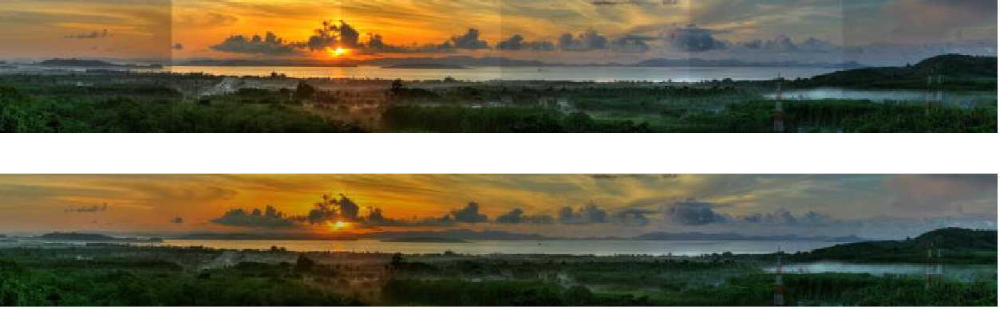

# Image Stitching

## 图像拼接代码  色彩亮度优化

ORB+GMS方法

色彩亮度均衡 复现了诺基亚研究中心《Color Matching of Image Sequences with Combined Gamma and Linear Corrections》论文的方法

色彩转换至YUV空间的线性校正

基于OpenCV 4.0

## 此版本非最终代码 如需帮助 请提交新issues
